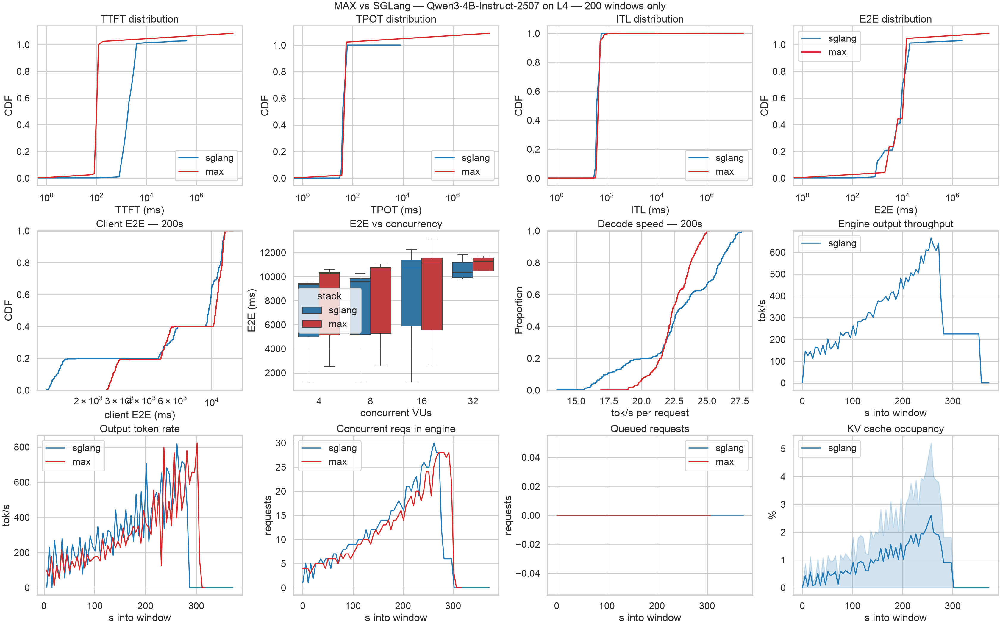

# Modular's MAX vs SGLang

An apples-to-apples latency/throughput comparison of two open inference stacks serving the same model on the same rented GPU infrastructure.

## Objective :

- Measure how a **small model's serving performance differs** between Modular's open-source **MAX** stack (`max serve`, Mojo kernels) and a **native SGLang + NVIDIA CUDA/Triton** stack.
- Focus metrics: **TTFT**, **TPOT/ITL**, end-to-end latency, output throughput, error rate.
- Constraints per spec: compute rented from **Modal** (≈$10 budget), load generated locally with **k6** (TypeScript scripts), infra orchestrated via **Terraform** smallest GPU that holds the full model in VRAM.

## Results :


| metric                    | SGLang                   | MAX                       |
| ------------------------- | ------------------------ | ------------------------- |
| TTFT p50 / p90 / p99      | 1829 / 3498 / 3912       | **100 / 117 / 121**       |
| ITL/token p50 / p90 / p99 | **39.8 / 55.8 / 59.6**   | 45.9 / 53.5 / 79.4        |
| E2E p50 / p90 / p99       | **8613 / 16463 / 19329** | 10222 / **13421 / 14148** |
| Peak output throughput    | ~650 tok/s               | ~800 tok/s                |


**Takeaway**:  
-> MAX is better at getting your request into the system quickly and predicting the first token and the tail of the output more reliably. SGLang, on the other hand, is faster once generation is underway—about 13% quicker per token during decoding—and usually has a better median end‑to‑end latency.

-> So neither one is clearly “best” overall; it depends on which part of latency you care about most. Also note that SGLang’s reported time‑to‑first‑token (TTFT) includes time spent waiting in an admission queue under load, which is an important detail when comparing numbers.

## Output

**Combined dashboard** (all panels, one image):



Individual panels in `[metrics/Qwen3-4B-Instruct-2507/01-37/plots/](metrics/Qwen3-4B-Instruct-2507/01-37/plots/)`:


| Latency CDFs                                                                  | Client + load                                                                               | Engine time-series                                                                                                                                                                                                    |
| ----------------------------------------------------------------------------- | ------------------------------------------------------------------------------------------- | --------------------------------------------------------------------------------------------------------------------------------------------------------------------------------------------------------------------- |
| [ttft_ms_cdf.png](metrics/Qwen3-4B-Instruct-2507/01-37/plots/ttft_ms_cdf.png) | [client_e2e_cdf.png](metrics/Qwen3-4B-Instruct-2507/01-37/plots/client_e2e_cdf.png)         | [throughput_ts.png](metrics/Qwen3-4B-Instruct-2507/01-37/plots/throughput_ts.png)                                                                                                                                     |
| [tpot_ms_cdf.png](metrics/Qwen3-4B-Instruct-2507/01-37/plots/tpot_ms_cdf.png) | [latency_vs_vu.png](metrics/Qwen3-4B-Instruct-2507/01-37/plots/latency_vs_vu.png)           | [tokens_out_ts.png](metrics/Qwen3-4B-Instruct-2507/01-37/plots/tokens_out_ts.png)                                                                                                                                     |
| [itl_ms_cdf.png](metrics/Qwen3-4B-Instruct-2507/01-37/plots/itl_ms_cdf.png)   | [completion_tps_cdf.png](metrics/Qwen3-4B-Instruct-2507/01-37/plots/completion_tps_cdf.png) | [batch_ts.png](metrics/Qwen3-4B-Instruct-2507/01-37/plots/batch_ts.png) · [queue_ts.png](metrics/Qwen3-4B-Instruct-2507/01-37/plots/queue_ts.png) · [kv_ts.png](metrics/Qwen3-4B-Instruct-2507/01-37/plots/kv_ts.png) |
| [e2e_ms_cdf.png](metrics/Qwen3-4B-Instruct-2507/01-37/plots/e2e_ms_cdf.png)   |                                                                                             |                                                                                                                                                                                                                       |


Tables: `[tables/summary.csv](metrics/Qwen3-4B-Instruct-2507/01-37/tables/summary.csv)` · `[tables/e2e_per_stage.csv](metrics/Qwen3-4B-Instruct-2507/01-37/tables/e2e_per_stage.csv)` — raw data: `sglang.prom`, `max.prom`, `k6/*.ndjson`, `logs/`, `manifest.json` in the same dir.

## Repo map

```
src/config.yaml          # single source of truth (model, gpu, regions, ports, volumes)
src/bench/               # shared pkg: settings/images/volumes/readiness/telemetry
src/apps/                # Modal app entrypoints: sglang_server.py, max_server.py
k6/                      # TypeScript load harness (esbuild → k6 run), run.mjs + config.yaml
infra/terraform/         # terraform_data + modal CLI (no working Modal provider exists)
scripts/collect_metrics.sh   # → metrics/<model>/<HH-MM>/ dump
scripts/analyze_metrics.py   # → 200-window slice, ms normalization, seaborn plots
third_party/modular/         # vendored OSS MAX source (reference)
plans/                       # timestamped plan + progress log
```

Reproduce analysis: `bash scripts/collect_metrics.sh && .venv/bin/python scripts/analyze_metrics.py`